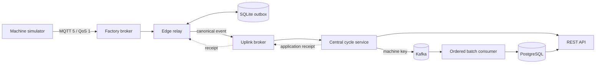

# Outboxer

**A local, failure-tested relay for synthetic machine-cycle events.**

[](LICENSE)
[](https://adoptium.net/)
[](https://kotlinlang.org/)

> Independent educational simulation; not affiliated with or endorsed by any equipment manufacturer. Synthetic data only.

Outboxer shows how to keep accepting edge events during an uplink outage, replay them without losing per-machine order, and expose one customer-visible database row even when transports redeliver. The entire system runs locally with Docker Compose. A temporary, isolated `kind` cluster provides an additional Kubernetes deployment proof; there is no cloud deployment or CI/CD.

## What this project proves

- MQTT 5 QoS 1 messages are acknowledged on the factory side only after a durable SQLite write.
- A central application receipt, rather than an MQTT acknowledgement alone, closes the edge outbox row.
- Stable event identities and PostgreSQL constraints turn at-least-once delivery into an effectively-once database effect.
- Partition keys and ordered worker shards preserve ordering for each machine while allowing machines to progress concurrently.
- Strict JSON Schema validation and quarantine paths isolate malformed messages without blocking valid traffic.
- Schema v2 adds optional energy consumption while v1 payloads and APIs remain compatible.

The formal 10-minute outage run buffered **60,072** outage events, peaked at **60,154** pending rows, restored readiness in **13.02 seconds**, drained while **23,004** live events continued, and finished with **84,914 expected identities = 84,914 PostgreSQL rows**. The measured gross recovery rate was **367.37 events/second**. See [reviewed evidence](docs/evidence/v1-outage.md).

## Guarantees and boundaries

Outboxer provides these properties within one local host while its named storage volumes remain intact:

- durable edge acceptance before source acknowledgement;
- at-least-once transport and replay;
- no customer-visible duplicate row for a repeated event identity;
- monotonic processing per `(tenantId, machineId)` within a machine boot;
- bounded retry with backoff and invalid-message isolation;
- observable liveness, readiness, lag, backlog, rejection, and duplicate signals.

It does **not** claim exactly-once network delivery, cross-region durability, broker clustering, disaster recovery, authentication through `X-Tenant-Id`, or production readiness. Destroying Docker volumes destroys local state. The single-node Kafka and PostgreSQL services are deliberate demo constraints.

## Architecture



The important boundary is event custody:

1. The simulator publishes a source event to the factory broker.
2. The edge validates the topic and payload, writes canonical bytes to SQLite with WAL and `synchronous=FULL`, then acknowledges the source delivery.
3. The edge publishes those stored bytes to the uplink broker with a response topic and correlation data.
4. The central service validates the event and waits for Kafka acknowledgement before publishing an application receipt.
5. The edge marks the row sent only after that receipt arrives.
6. A Kafka batch transaction writes the event, deduplication state, and data-quality state to PostgreSQL before the consumer offset advances.

The full rationale is in [architecture](docs/architecture.md) and [reliability model](docs/reliability-model.md).

## Components

| Component | Responsibility | Runtime |
| --- | --- | --- |
| `contracts` | Source, canonical, and receipt records; JSON Schemas v1/v2; strict validation | Java 21 |
| `machine-simulator` | Deterministic 3,000-machine synthetic event source | Kotlin/JVM |
| `edge-relay` | Factory intake, durable SQLite outbox, replay, receipt handling | Kotlin + Spring Boot |
| `central-cycle-service` | MQTT intake, Kafka bridge, PostgreSQL store, REST API | Java + Spring WebFlux |
| `infra` | Two Mosquitto brokers, Kafka, PostgreSQL, Compose, Kubernetes manifests | Containers/YAML |
| `scripts` | Repeatable smoke, load, crash-window, outage, kind, and release checks | Java/PowerShell/Bash |

## Prerequisites

- Docker Desktop or another Docker Engine with Compose v2
- Java 21 (the repository includes the Gradle wrapper)
- Git
- About 8 GiB of free memory and 6 GiB of free disk for the full acceptance suite
- PowerShell 7 on Windows, or Bash with `curl`, `sha256sum`, and standard Unix tools

Only these loopback ports are published:

| Port | Service |
| ---: | --- |
| `11883` | factory MQTT |
| `11884` | uplink MQTT |
| `15432` | PostgreSQL |
| `18080` | central API and management endpoints |
| `18081` | edge management endpoints |
| `19092` | Kafka |

The startup script generates local MQTT and database credentials under ignored `.secrets/`; credentials are never committed.

## Run locally

PowerShell:

```powershell
.\scripts\start-local.ps1
```

Bash:

```bash
./scripts/start-local.sh
```

The default simulator emits a deterministic 25% v2 mix from 3,000 machines at approximately 100 events/second. Check the services:

```bash
curl --fail http://127.0.0.1:18081/actuator/health/readiness
curl --fail http://127.0.0.1:18080/actuator/health/readiness
```

Stop only this project's containers while preserving its volumes:

```powershell
.\scripts\stop-local.ps1
```

```bash
./scripts/stop-local.sh
```

## Query the API

All three fixed API endpoints require `X-Tenant-Id`. It is local-demo scoping, **not authentication**. Examples use the simulator defaults:

```bash
curl -H "X-Tenant-Id: tenant-017" \
  http://127.0.0.1:18080/api/v1/machines/IMM-0001/cycles/latest

curl -H "X-Tenant-Id: tenant-017" \
  "http://127.0.0.1:18080/api/v1/machines/IMM-0001/cycles?limit=10"

curl -H "X-Tenant-Id: tenant-017" \
  http://127.0.0.1:18080/api/v1/machines/IMM-0001/data-quality
```

`limit` must be between 1 and 100. Responses set `Cache-Control: no-store`. API documentation is available locally at [http://127.0.0.1:18080/swagger-ui.html](http://127.0.0.1:18080/swagger-ui.html) while the stack is running.

## Test the reliability claims

Fast and container integration verification:

```powershell
.\gradlew.bat clean check integrationTest contractCompatibilityTest
```

```bash
./gradlew clean check integrationTest contractCompatibilityTest
```

Executable acceptance tests are deterministic and produce ignored raw reports in `.outboxer/evidence/generated/`:

| Proof | PowerShell | Bash | Typical duration |
| --- | --- | --- | ---: |
| Compose smoke | `.\scripts\compose-smoke.ps1 -Reset` | `./scripts/compose-smoke.sh --reset` | 2–4 min |
| 100 events/sec | `.\scripts\load-test.ps1 -DurationSeconds 60 -Reset` | `./scripts/load-test.sh --duration-seconds 60 --reset` | 2–4 min |
| Crash windows | `.\scripts\crash-window-test.ps1 -Reset` | `./scripts/crash-window-test.sh --reset` | 6–9 min |
| 10-minute outage | `.\scripts\outage-test.ps1 -OutageSeconds 600 -Reset` | `./scripts/outage-test.sh --outage-seconds 600 --reset` | 15–20 min |

`-Reset` / `--reset` removes exactly these disposable Outboxer volumes before the run:

```text
outboxer-factory-mqtt-data
outboxer-uplink-mqtt-data
outboxer-edge-data
outboxer-kafka-data
outboxer-postgres-data
```

Do not use the reset option when you need to preserve local demo data. The scripts scope Docker operations to project `outboxer` and do not stop unrelated Compose projects.

Reviewed, repository-safe result summaries:

- [10-minute v1 outage](docs/evidence/v1-outage.md)
- [sustained load](docs/evidence/load.md)
- [deterministic crash windows](docs/evidence/crash-windows.md)
- [v1/v2 Compose smoke](docs/evidence/v2-compose-smoke.md)
- [isolated kind smoke](docs/evidence/kind-smoke.md)

## Prove the Kubernetes deployment locally

The base manifests deploy only the two application workloads; Compose supplies the stateful dependencies. The script uses a dedicated temporary kubeconfig, pins the kind node image, validates cached schemas with network access disabled, loads locally built images, runs an exact 100-event v1/v2 assertion, and deletes the temporary cluster.

```powershell
.\scripts\kind-smoke.ps1
```

```bash
./scripts/kind-smoke.sh
```

No registry push or cloud cluster is involved. An existing `kubectl` context is never used for mutation. See [Kubernetes proof details](infra/k8s/README.md).

## Contract evolution

| Wire version | Change | Database/API representation |
| --- | --- | --- |
| v1 | Original cycle payload | `energyConsumptionWh` is `null` |
| v2 | Adds optional, non-negative `energyConsumptionWh` | Numeric value when supplied |

Schemas reject unknown fields and invalid values for their declared version. A v1 sender therefore retains its original wire shape, while the nullable database migration and stable API response allow old and new events to coexist. See [ADR 0004](docs/adr/0004-backward-compatible-schema-evolution.md).

## Observe it

- Edge health: `http://127.0.0.1:18081/actuator/health/{liveness,readiness}`
- Edge metrics: `http://127.0.0.1:18081/actuator/prometheus`
- Central health: `http://127.0.0.1:18080/actuator/health/{liveness,readiness}`
- Central metrics: `http://127.0.0.1:18080/actuator/prometheus`

Notable bounded-cardinality metrics include `edge_outbox_pending`, `edge_outbox_oldest_pending_age_seconds`, `edge_events_invalid_total`, `edge_receipt_timeouts_total`, `cloud_events_received_total`, `cloud_duplicate_events_total`, `cloud_sequence_gaps_total`, and `cloud_ingestion_lag_seconds`.

## Security and safety

Compose creates generated credentials, Mosquitto topic ACLs, segmented networks, loopback-only host bindings, non-root application images, read-only root filesystems, dropped Linux capabilities, and `no-new-privileges`. Kubernetes adds restricted pod security, seccomp, disabled service-account token mounting, and explicit resources.

This remains a local educational system. MQTT traffic is unencrypted inside isolated local networks, API tenant headers are not identity proof, and local operators retain access to all volumes. The [threat model](docs/threat-model.md) describes the boundary; [SECURITY.md](SECURITY.md) explains private reporting. Mutual TLS and external identity are post-v1 hardening options.

## Repository guide

- [Architecture](docs/architecture.md)
- [Reliability model](docs/reliability-model.md)
- [Testing strategy](docs/testing.md)
- [Threat model](docs/threat-model.md)
- [Troubleshooting](docs/troubleshooting.md)
- [Architecture decisions](docs/adr/)
- [Mock pull request](docs/mock-pull-request.md)
- [Third-party notices](THIRD_PARTY_NOTICES.md)

Run the full local release guard from a clean checkout:

```powershell
.\scripts\verify.ps1
```

```bash
./scripts/verify.sh
```

The guard runs tests, strict Kubernetes validation, dependency inventory, Git-history association checks, high-confidence secret checks, local-link validation, and repository cleanliness checks. It creates no remote resources.

## License

Outboxer source code is released under the [MIT License](LICENSE). Third-party components keep their respective licenses; see [THIRD_PARTY_NOTICES.md](THIRD_PARTY_NOTICES.md).
