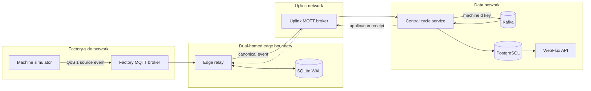
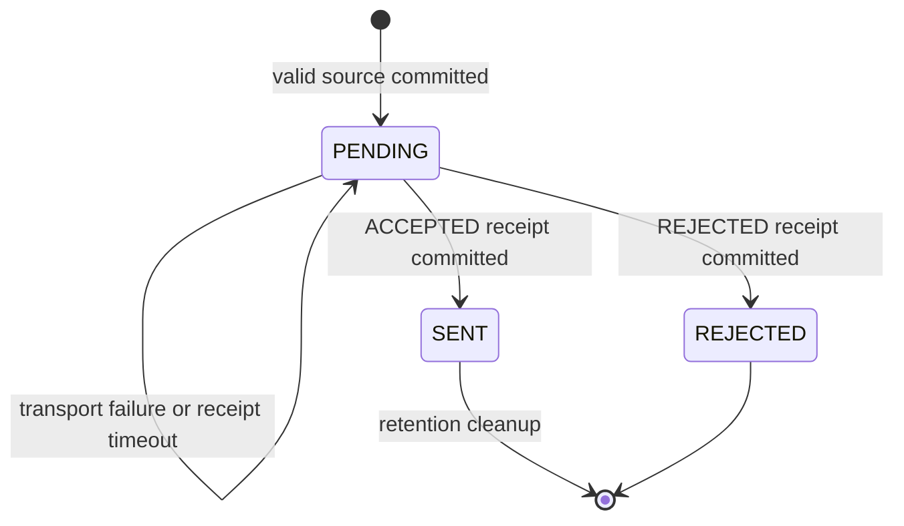

# Architecture

Outboxer is a local reference implementation of a reliable edge-to-central path for one synthetic business event, `CYCLE_COMPLETED`. The design makes every custody transfer explicit and tests the two ambiguous crash windows that commonly cause loss or duplicate effects.

## System context



Docker networks enforce the intended topology. The edge relay is the only application on both `factory-net` and `uplink-net`. The central service joins `uplink-net` and `data-net`; the simulator cannot reach Kafka or PostgreSQL. Host ports bind to loopback only.

## Event forms and topics

| Stage | Topic | Payload |
| --- | --- | --- |
| Machine to edge | `factory/{machineId}/cycles` | strict source schema v1 or v2 |
| Edge to central | `uplink/{siteId}/{machineId}/cycles` | strict canonical schema with `edgeReceivedAt` |
| Central to edge | `receipts/{siteId}/cycles` | v1 `ACCEPTED` or `REJECTED` receipt |
| Central durable log | `cycle-events` | canonical JSON, keyed by `machineId` |
| Invalid central data | `cycle-events-invalid` | reason, timestamp, hash, topic, bounded excerpt |

Identifiers must match `[A-Za-z0-9._-]+` and are limited to 64 characters. Topic identity must match payload identity. Payloads are capped at 64 KiB by the brokers and application validators. JSON Schema Draft 2020-12 documents are the wire-contract authority.

## End-to-end sequence

```mermaid
sequenceDiagram
    participant M as Simulator
    participant F as Factory MQTT
    participant E as Edge relay
    participant S as SQLite
    participant U as Uplink MQTT
    participant C as Central service
    participant K as Kafka
    participant P as PostgreSQL

    M->>F: PUBLISH QoS 1
    F->>E: source delivery
    E->>E: validate topic + source schema
    E->>S: INSERT PENDING (transaction)
    S-->>E: durable commit
    E-->>F: acknowledge delivery
    E->>U: canonical PUBLISH + response topic + correlation
    U->>C: canonical delivery
    C->>C: validate topic + payload + request metadata
    C->>K: publish keyed record
    K-->>C: acknowledged write
    C->>U: ACCEPTED receipt
    C-->>U: acknowledge canonical delivery
    U->>E: receipt delivery
    E->>S: PENDING to SENT
    S-->>E: transaction commit
    E-->>U: acknowledge receipt
    K->>C: ordered partition batch
    C->>P: idempotent set-based transaction
    P-->>C: commit
    C-->>K: listener returns; offset may advance
```

The accepted receipt means Kafka has acknowledged custody; it does not mean the query model has already consumed the record. This separation lets the edge release its local backlog while the central consumer catches up independently.

## Edge relay

The source callback validates and normalizes each event, adds `edgeReceivedAt`, and places work on a bounded queue. A single writer batches up to 500 rows or 10 milliseconds into one SQLite transaction. Manual MQTT acknowledgement occurs only after that transaction returns. If persistence fails, the client disconnects so the persistent broker session can redeliver unacknowledged messages.

SQLite runs in WAL mode with full synchronous durability and a busy timeout. Startup rejects a database whose active pragmas do not match the required durability profile. The outbox uses three terminal states:



The dispatcher selects a row only when no earlier pending row exists for the same tenant, site, and machine. It assigns machines to 64 serial executors, tracks in-flight rows, and applies capped exponential retry. A transport acknowledgement alone leaves the row pending. Receipt correlation, event identity, site identity, and schema all have to validate before settlement.

Malformed source messages and conflicting natural identities are written to `edge_rejected_message` with a SHA-256 hash, bounded excerpt, and reason. They are then acknowledged so one poison message cannot block a persistent session.

## Central service

The MQTT gateway assigns a machine to one of 64 serial ingress executors. It validates canonical JSON, topic identity, response topic, and correlation data. A valid record is sent to a 12-partition Kafka topic with `machineId` as its key and the first central receipt timestamp in a header. The gateway publishes `ACCEPTED` only after Kafka acknowledges the record.

Invalid MQTT input is written to the three-partition invalid topic before it is acknowledged. Where request metadata is usable, the sender also receives a `REJECTED` application receipt.

The Kafka listener uses three consumers and batch polls of at most 250 records. It revalidates every payload and key, then executes set-based inserts and data-quality updates in one PostgreSQL transaction. A database failure is retried indefinitely at the same uncommitted partition position. A valid duplicate increments quality accounting; a repeated identity with different content is classified as a conflict and copied to the invalid topic.

## Ordering model

Ordering is scoped per machine, not globally:

1. Source sequences are monotonic within a `machineBootId`.
2. SQLite selection prevents a later row from overtaking an earlier pending row for the same scoped machine.
3. A stable hash sends the same machine through one edge executor.
4. Kafka uses `machineId` as the record key, so one machine remains on one partition.
5. The batch listener processes records in poll order and commits before offsets advance.

Different machines may progress concurrently. A new boot identity restarts the sequence space; data-quality state records the active boot and cumulative gaps.

## Storage model

| Store | Durable facts | Idempotency boundary |
| --- | --- | --- |
| Mosquitto factory volume | unacknowledged QoS 1 source deliveries | MQTT packet/session semantics |
| SQLite edge volume | canonical bytes, identity, state, attempt timing, rejection evidence | `event_id` and `(tenant, site, machine, boot, sequence)` unique keys |
| Mosquitto uplink volume | unacknowledged events and receipts | MQTT packet/session semantics |
| Kafka volume | canonical central log and invalid-event log | idempotent producer plus partition offsets |
| PostgreSQL volume | query rows and machine data-quality state | event, natural identity, and Kafka-position unique keys |

Flyway owns both SQLite and PostgreSQL schema migrations. V2 adds one nullable, non-negative `energy_consumption_wh` column, so existing v1 rows remain valid.

## Health and overload behavior

Liveness answers whether the process can run. Readiness also checks dependency connectivity and durable storage. The edge becomes unready when the uplink is unavailable or pending rows exceed the configured threshold, while liveness stays up so it can continue receiving and persisting source events. Bounded in-memory queues push overload back toward MQTT persistent sessions; they are not alternate durable stores.

Metrics never label by tenant, site, machine, or event identity. This keeps cardinality bounded at the demonstrated 3,000-machine scale.

## Deployment boundary

Docker Compose is the complete executable environment and the only environment used for outage and crash evidence. Named volumes survive application and container restarts. They do not survive explicit volume deletion, host loss, or storage failure.

The Kubernetes base contains only the edge and central application workloads. The kind proof attaches one temporary node to the Compose dependency networks and supplies generated endpoint objects and secrets at runtime. It is deployment evidence, not a highly available platform design.
